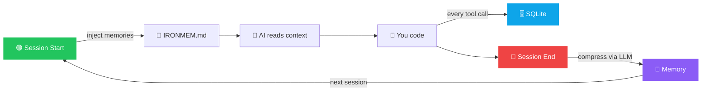

<p align="center">
  
  <br/>
  
</p>

<p align="center">
  <strong>Persistent memory for AI coding assistants.</strong>
</p>

<p align="center">
  Stop re-explaining your project every time you start a new session.
</p>

<p align="center">
  <a href="#install">Install</a> &bull;
  <a href="#how-it-works">How It Works</a> &bull;
  <a href="#cli">CLI</a> &bull;
  <a href="#multi-provider-support">Multi-Provider</a> &bull;
  <a href="#contributing">Contributing</a>
</p>

<p align="center">
  
  
  
  
  
  
  
  <a href="https://github.com/BMC-INC/Iron-mem/actions/workflows/rust.yml"></a>
</p>

<p align="center">
  
  
  
  
  
  
  
</p>

---

<!-- SEO Keywords: AI coding assistant memory, session-aware AI tools, Rust AI tools, context preservation, Claude Code memory, Cursor context -->

## What's New in v0.4.0

> IronMem is now a full durable memory stack: reversible originals, typed memories,
> temporal graph recall, source-backed retrieval, adaptive skim/expand context,
> sleep-cycle compression, and 21 MCP tools.

- **CCR — losslessly reversible memory** (Headroom pattern) — every truncated tool
  output and the verbatim pre-LLM session transcript is preserved in a
  content-addressed, deduplicated, byte-exact compressed blob store inside the DB.
  **`retrieve_original`** pulls the exact original back by `observation_id`,
  `memory_id`, raw blob `hash`, or the `chunk_id` expansion handle.
- **Memory scoping & typed memories** (Supermemory patterns) — memories carry a
  **scope** (`project` vs. `user`/cross-project) and a **kind** (`session`, `fact`,
  `error_solution`, `preference`, `procedural`, `architecture`, `learned_pattern`,
  `project_config`, `profile`). Session-start injection ranks **project ∪ user**
  memories and boosts durable kinds.
- **Dual-output compression** — session compression writes both a narrative memory
  and separate searchable `kind=fact` memories, so dates, names, quantities, and
  direct answers survive summarization.
- **Record-run retrieval stack** — hybrid FTS/vector/graph recall now includes
  routed weighted fusion, source-fact retention, temporal event boosts, multi-hop
  query expansion, deterministic query decomposition, entity alias expansion,
  temporal conflict handling, structured-evidence reranking, rerank re-anchoring,
  and optional cross-encoder reranking.
- **Adaptive working-memory skim** — every compressed or explicit memory gets
  durable `memory_chunks` with density, kind, title, token estimate, and optional
  exact transcript offsets. Agents can skim broadly with **`memory_skim`**, then
  expand exact evidence with **`retrieve_original(chunk_id=...)`**.
- **Governed recall** — memories carry namespace, source type, trust tier,
  writer/source provenance, classification, consent state, residency, retention
  metadata, legal hold, tombstone state, record hash, and an append-only ledger
  hash chain. Reads are namespace-scoped and active-only by default; PHI/PII
  writes fail closed unless consent is granted.
- **Closed-loop memory quality** — injection events and explicit feedback reinforce
  useful memories and decay repeatedly ignored or corrected memories without
  deleting provenance.
- **Sleep-cycle auto-compression** — `ironmem sweep` and `ironmem scheduler run`
  compact idle or high-volume sessions without manual `session_end`, with DB
  leases, dry-run mode, audit events, and slower dream/reflection passes.
- **GPU-ready cross-encoder reranking** — `rerank.backend = "cross_encoder"` uses
  the local ONNX reranker when available, with a `gpu` feature for CUDA-backed
  benchmark-scale runs and a safe fallback when the model is unavailable.
- **AST-bound Rust anchors** — `ironmem code-relink` uses Tree-sitter to hash Rust
  symbols and relink memories when code moves across files.
- **Reflection, snapshots, and sync** — dry-run-first consolidation proposals,
  CCR-backed project brain snapshots, and an idempotent Lamport-clock sync event
  log support long-lived and multi-agent memory workflows.
- **`remember` tool** — store an explicit, typed memory in one call (`scope`, `kind`,
  `text`, `tags`). User-scope facts follow you into every project and also enter
  the skim layer.
- **User profile** — cross-project memories are distilled into a single
  always-injected profile. Read/regenerate with **`get_profile`** /
  **`refresh_profile`**.
- **Correction miner** — error→fix loops are mined into `error_solution` memories
  and surfaced via **`list_corrections`**, so past fixes resurface when work recurs.
- **21 MCP tools** now — including `memory_skim`, `retrieve_original`, `remember`,
  `get_profile`, `refresh_profile`, `list_corrections`, `memory_graph`, and
  `reconcile_memory_graph`.
- **Temporal recall + graph recall** — dated facts and `event_time` metadata power timestamp lookup, while `memory_edges` stores structured `source | relation | target` edges with valid-time filters and provenance. Temporal questions route toward date-bearing facts; relationship questions route toward graph edges.
- **Memory Graph Workbench** — the built-in local UI is now a temporal graph
  investigation surface with project/query/date/history filters, an interactive
  canvas, retrieval-trace highlighting, governed memory metadata, structured
  chunks, graph provenance, and one-click expansion to exact original source.
- **Benchmarked on LoCoMo:** 68.4% overall (Gemini 2.5 Pro answerer + Pro judge, 1,540 scored questions, 0 errors) with governance-off retrieval, +2.1 points over the governed baseline. Full harness, result files, and reproduction: **[ironmem-locomo-benchmark](https://github.com/BMC-INC/ironmem-locomo-benchmark)**. See [Benchmarks](#benchmarks).
- **External storage adapters:** a `StorageBackend` trait with a HYBRID mode lets vector and graph layers run on real external backends (Qdrant over HTTP for vectors, Neo4j for the graph) instead of only the embedded SQLite store, while keeping the native path the default.
- **Retrieval + governance instrumentation:** governance-cost timings in `/status`, a temporal-trust trajectory signal, a compression coverage pass, and the path-to-70 retrieval batch (routed fusion, structured evidence, pool/context tuning, multi-hop decomposition, entity aliases, temporal conflict handling, and source-backed evidence chains).
- **Valid-time temporal recall:** `remember` accepts an optional `event_at` (an ISO `YYYY-MM-DD` date or a `YYYY-MM-DD..YYYY-MM-DD` range) for when an event actually occurred, distinct from the storage time (`created_at`). Valid-time dates are surfaced through an `event_times` side map on search, list, context, and skim results, powering time-aware retrieval.
- **Derived (inferred) memories:** reflection can derive new memories from existing ones, governed as `source_type=derived` / `kind=inference` with a `derives` provenance edge and a ledger entry per inference. Derived memories are quarantined from default retrieval until a caller explicitly asks for them, so inferences never silently pollute primary recall.
- **Opt-in auto-dream trigger:** a thin background watcher (`auto_dream.enabled`, default off, with a `gap_minutes` idle threshold) fires a consolidation and synthesis pass on projects that have gone idle. Every auto-triggered pass is recorded in the governance ledger with a `trigger_reason`, so it stays auditable instead of a black box.
- **Current verification:** `cargo test --bin ironmem` passes **203 tests** with
  **1 ignored benchmark**, MCP stdio cleanliness passes, and the strict
  `local-onnx` clippy gate is clean.
- **Still zero telemetry. Still local-first. Your data stays yours.**

<details>
<summary>v0.3.0</summary>

- **Multi-provider compression** — use OpenAI, Google Gemini, or Anthropic as your LLM. Set `"provider": "openai"` in settings.
- **Neovim plugin** — native Lua plugin with auto session lifecycle, `:IronMemSearch`, `:IronMemStatus`
- **Windows support** — `install.ps1`, platform-aware messages, robust home directory detection
- **Web UI** — browse, search, and delete memories at `http://localhost:37778/ui`
- **Discovery tools** — list known projects, search across all projects, and inspect per-project session history
- **Still zero telemetry. Still local-first. Your data stays yours.**
</details>

<details>
<summary>v0.2.0</summary>

- **Initial 13 MCP tools** — session_start, session_end, record_event,
  compress_session, get_context, get_status, list_memories, search_memories,
  search_global, list_projects, list_sessions, inject_context, wipe_project
- **Dual database** — SQLite (local, FTS5 full-text search) + Postgres (self-hosted, tsvector) via `DATABASE_URL`
- **Every MCP client** — Claude Desktop, Claude Code, Cursor, Windsurf, ChatGPT Desktop, Zed, and more
- **Docker deployment** — `docker-compose up` for remote/team setups with Postgres
- **`ironmem mcp`** — new subcommand for direct MCP stdio transport (Claude Desktop/Code)
- **REST server still works** — existing hooks and curl-based workflows unaffected
</details>

---

IronMem gives AI coding tools persistent memory across sessions.
It silently records what happened during your session, compresses it into concise memory, and injects that context into your next session automatically.

No copy-pasting.
No rebuilding context from scratch.
No "remember when we refactored auth yesterday?"

**Works with every major AI coding tool** — Claude Code, Claude Desktop, Cursor, Windsurf, ChatGPT Desktop, GitHub Copilot, Zed, VS Code, and any MCP-compatible client.

**Compress with the LLM you already pay for** — Anthropic Claude, OpenAI GPT-4o,
Google Gemini, or Vertex AI Gemini. Switch providers with one config change.

**Free and open source.** Runs locally or on your own infrastructure. No telemetry.
No cloud dependency. No subscription. SQLite or Postgres storage. Single Rust binary.

<p align="center">
  
</p>

## Why this exists

AI coding tools are great inside a session and terrible across sessions.
They help you ship faster, but every fresh session forgets your architecture decisions, debugging trail, and what changed yesterday.

IronMem fixes the handoff.

## Before vs after

Without IronMem:

> "We already changed the auth middleware, switched to JWT, updated the migration, and fixed the failing tests in billing. Let me explain the whole thing again."

With IronMem:

> Open a new session. Your assistant already has the recent project context.

---

## Quick Start

1. **Install IronMem**:
   ```bash
   curl -fsSL https://raw.githubusercontent.com/BMC-INC/Iron-mem/main/install.sh | bash
   ```
2. **Add your API key** to IronMem's key file:
   ```bash
   echo "your-key-here" > ~/.ironmem/api_key && chmod 600 ~/.ironmem/api_key
   ```
   > **Prefer the key file over `export ANTHROPIC_API_KEY`.** Claude Code and
   > some other tools bill against `ANTHROPIC_API_KEY` whenever it is set in your
   > shell. The key file keeps IronMem's key out of your environment so it cannot
   > change how other tools bill. IronMem still honors the env var if you prefer it.
3. **Start coding!** IronMem handles the rest silently in the background.

---

## Table of Contents

- [Quick Start](#quick-start)
- [The Problem](#the-problem)
- [The Fix](#the-fix)
- [Who Should Use This?](#who-should-use-this)
- [How It Works](#how-it-works)
- [Current Memory Stack](#current-memory-stack)
- [Install](#install)
- [CLI](#cli)
- [Multi-Provider Support](#multi-provider-support)
- [MCP Setup](#mcp-setup)
- [MCP Tools](#mcp-tools)
- [Web UI](#web-ui)
- [Governed Memory](#governed-memory)
- [Configuration](#configuration)
- [Testing Status](#testing-status)
- [Troubleshooting](#troubleshooting)
- [Architecture](#architecture)
- [Why Rust?](#why-rust)
- [Design Principles](#design-principles)
- [Why not just use CLAUDE.md?](#why-not-just-use-claudemd)
- [Roadmap](#roadmap)
- [Contributing](#contributing)
- [Support](#-support)
- [License](#license)

---

## The Problem

Every time you start a new session with Claude Code, Cursor, Copilot, or any AI
coding assistant, it starts from zero. It does not know what you built yesterday,
what broke, or what you decided.

**You end up re-explaining context every single session.**

## The Fix

IronMem silently records what happens during your coding session, compresses it
with your configured provider, and injects that context into your next session
automatically.

No setup per session. No copy-pasting. No "remember when we..."

<p align="center">
  
</p>

> **Without IronMem:** _"Hey Claude, remember yesterday we refactored the auth middleware and switched to JWT? And the database migration for the users table? And..."_
>
> **With IronMem:** You open a new session. It already knows.

---

## Who Should Use This?

IronMem is designed for:
- **Developers frustrated with re-explaining context** to AI tools every single session.
- **Teams working on large, multi-session projects** where context gets easily lost.
- **Developers frequently switching** between multiple AI tools like Copilot, Claude Code, Windsurf, or Cursor.
- **Solo developers** who want to maintain flow and continuity without manual effort.

---

## How It Works



Everything runs locally. Your data stays on your machine.

---

## Current Memory Stack

IronMem now stores memory in several cooperating layers rather than one flat
summary:

- **Session transcript CCR:** verbatim pre-LLM transcripts and large/truncated
  tool outputs in content-addressed compressed blobs.
- **Narrative memories:** concise session summaries in the `memories` FTS table.
- **Typed facts:** separate `kind=fact` memories extracted from compression, so
  dates, names, quantities, and direct answers survive summarization.
- **Procedural memories:** reusable workflow rules as `kind=procedural`.
- **Error solutions:** mined fail→edit→pass loops as `kind=error_solution`.
- **User profile:** global `scope=user`, `kind=profile` memory injected across
  projects.
- **Temporal graph:** `source | relation | target` edges with valid-time fields,
  confidence, and memory provenance.
- **Adaptive skim chunks:** `memory_chunks` rows with `chunk_id`, density, kind,
  title, token estimate, and optional exact transcript byte offsets.
- **Observation logs (opt-in):** the Observer pass emits an append-only,
  timestamped, priority-tagged log beside the narrative — each line its own
  governed `kind=observation` memory with the event's own date and lineage back
  to its session — so specifics survive that summarization would generalize away.
- **Maturity tiers:** memories graduate `draft → stable → core` via the dream
  sweep as they earn injections and positive feedback, feeding the optional
  activation ranking lever.

Retrieval is routed by query shape:

- **Temporal lookup queries** prioritize date-bearing `kind=fact` memories and
  suppress graph-only hits that would otherwise promote relationship memories
  over timestamp answers.
- **Relationship queries** keep graph fusion enabled and rank edges by relation/source/target overlap.
- **General project recall** blends FTS, vectors when available, event-time boosts, graph signals, kind boosts, importance, and recency.
- **Skim/expand workflows** use `memory_skim` or `/skim` first, then `retrieve_original` with a `chunk_id` for exact transcript evidence.

This is intentionally model-agnostic. The durable store is hard-token,
structured, and auditable, so Claude, Codex, Operator OS, desktop clients, and
remote MCP clients can share the same backing memory.

---

## Benchmarks

IronMem is evaluated on [LoCoMo](https://github.com/snap-research/locomo) (Maharana et al., ACL 2024), a long-term conversational memory benchmark. The full harness, result files, and reproduction steps live in a dedicated repo: **[ironmem-locomo-benchmark](https://github.com/BMC-INC/ironmem-locomo-benchmark)**.

Headline (Gemini 2.5 Pro answerer + Pro judge, hybrid retrieval, pool 100, retrieve-limit 25, v2 answer prompt, 1,986 questions of which 1,540 are scored, 0 errors):

| Configuration | Overall | single_hop | multi_hop | temporal | open_domain |
|---|---|---|---|---|---|
| Governed (trust-tier ranking on) | 66.3% | 69.0% | 50.0% | 77.9% | 52.1% |
| **Governance-off (pure relevance ranking)** | **68.4%** | 72.1% | 52.5% | 78.2% | 50.0% |

Setting the writer-tier and temporal-trust retrieval weights to 0 (ranking on pure relevance) scores **68.4%**, **+2.1 points** over the governed configuration. Governance metadata (writer identity, trust tier, provenance, ledger) is still recorded and queryable on every memory; the finding is only that letting trust tier tilt retrieval ranking was net-negative on this benchmark. The benchmark repo has the per-category analysis, second-judge agreement (Cohen's kappa 0.88), and the documented path past 70%.

### LongMemEval

An in-repo harness runs [LongMemEval](https://github.com/xiaowu0162/LongMemEval) (Wu et al., ICLR 2025) against the live write + retrieval pipeline with per-ability breakdowns (information extraction, multi-session reasoning, temporal reasoning, knowledge updates, abstention):

```bash
ironmem bench longmemeval --data longmemeval_s.json               # scored run (needs an LLM API key)
ironmem bench longmemeval --data longmemeval_s.json --full-context # the published baseline column
ironmem bench longmemeval --data longmemeval_s.json --dry-run      # pipeline smoke test, no API key
```

Every report records the answer model, judge model, embedder, and retrieval depth so runs are comparable — scores are only published next to a same-model full-context baseline. Deterministic retrieval-quality regression checks (42 cases across multi-hop, temporal, open-domain, knowledge-update, abstention, governance-parity, entity, and chunk clusters) run via `ironmem eval` and gate CI on every change.

LongMemEval writes each completed question to an atomic checkpoint inside the
`--out` directory before advancing. Restart the same command with the same
dataset, commit, models, embedder, and options to resume without repeating paid
answer or judge calls. A mismatched configuration is rejected; use a new
`--out` directory for a fresh run.

---

## Install

```bash
curl -fsSL https://raw.githubusercontent.com/BMC-INC/Iron-mem/main/install.sh | bash
```

Or clone and build manually:

```bash
git clone https://github.com/BMC-INC/Iron-mem.git
cd Iron-mem
chmod +x install.sh
./install.sh
```

**Windows:**

```powershell
git clone https://github.com/BMC-INC/Iron-mem.git
cd Iron-mem
powershell -ExecutionPolicy Bypass -File install.ps1
```

Add IronMem to your `PATH` and write your API key to IronMem's key file:

```bash
export PATH="$HOME/.ironmem/bin:$PATH"          # in ~/.zshrc / ~/.bashrc
echo "your-key-here" > ~/.ironmem/api_key && chmod 600 ~/.ironmem/api_key
```

> Use the key file, not `export ANTHROPIC_API_KEY`. A global
> `ANTHROPIC_API_KEY` can change how other tools bill. IronMem reads
> `~/.ironmem/api_key` automatically.

Restart your terminal and Claude Code. That's it.

**Requirements:** Rust/Cargo (the installer will tell you if it's missing)

---

## CLI

```bash
ironmem server              # Start REST + MCP SSE server
ironmem mcp                 # Start MCP stdio server (for Claude Desktop/Code)
ironmem serve               # Start SSE server with bearer token auth
ironmem serve --public      # Same + Cloudflare Tunnel for remote MCP clients
ironmem serve --public --no-auth  # Authless public tunnel for claude.ai personal use
ironmem status              # Health check + DB stats
ironmem projects            # All projects with stored memories
ironmem list                # Recent memories for current project
ironmem search "auth middleware"  # Hybrid (keyword + semantic) search across memories
ironmem search-global "auth middleware"  # Search across all projects
ironmem sessions            # Session history for current project
ironmem inject              # Manually rebuild IRONMEM.md (relevance-ranked)
ironmem remember "..."      # Store an explicit memory (--scope user, --kind preference, --tags)
ironmem remember "..." --classification pii --consent-state granted --namespace tenant-a
ironmem forget <memory-id> --reason "user requested erasure"
ironmem profile             # Show the user profile (--refresh to regenerate it)
ironmem corrections         # List mined error→fix memories (--all for every project)
ironmem graph "Operator OS" # Query temporal graph edges (--history includes superseded edges, --at filters valid time)
ironmem graph-delete <edge-id> # Mark a bad graph edge user_deleted
ironmem graph-update <edge-id> --source A --relation owns --target B # Human-curate a graph edge
ironmem reconcile --dry-run # Preview duplicate/current-state graph reconciliation
ironmem graph-backfill --limit 50 # Extract graph relations from older memories
ironmem feedback <memory-id> --signal used --weight 1 # Reinforce or decay a memory
ironmem reflect --dry-run # Propose durable-memory consolidation
ironmem code-relink --dry-run # Tree-sitter Rust AST anchoring/relinking
ironmem snapshot create --label before-refactor # CCR-backed project brain snapshot
ironmem sync publish --node ci --op error_solution --payload '{"memory_id":1}' # Multi-agent event log
ironmem eval                # Run deterministic memory-quality evals into docs/evals
ironmem bench longmemeval --data longmemeval_s.json # LongMemEval harness (--full-context baseline, --dry-run keyless smoke)
ironmem compliance-report   # EU AI Act Art. 12/13 report: ledger chain verification, governance inventory, snapshots
ironmem ledger-migrate      # Export deterministic fork evidence; add --apply to begin a repaired forward-only epoch
ironmem lineage <memory-id> # Memory→action lineage: writer, ledger trail, every injection into an agent context
ironmem compress <id>       # Manually compress a session
ironmem sweep --compress-idle 30m --min-observations 50 --dry-run # Preview auto-compression
ironmem sweep --dream-due --apply # Run due sleep/dream consolidation
ironmem scheduler run       # Long-lived unattended sleep-cycle worker
ironmem scheduler install-launchd # Install/start the macOS sleep-cycle agent
ironmem embed               # Backfill semantic embeddings for existing memories
ironmem gc                  # Reclaim unreferenced CCR blobs (after wipes)
ironmem wipe                # Delete all memories for current project
ironmem config              # Print current settings
```

<p align="center">
  
</p>
<p align="center">
  
</p>

---

## Multi-Provider Support

IronMem works as an **MCP server** (native integration) or via **IRONMEM.md** (plain markdown, universal):

| Platform | MCP Native | IRONMEM.md | Setup |
| -------- | :--------: | :--------: | ----- |
| **Claude Code** | **Yes** | Yes | [Setup →](#claude-code-mcp-setup) |
| **Claude Desktop** | **Yes** | Yes | [Setup →](#claude-desktop-mcp-setup) |
| **claude.ai** | **Yes** | Yes | [Setup →](#claudeai-web) |
| **Cursor** | **Yes** | Yes | [Setup →](#cursor--windsurf-mcp-setup) |
| **Windsurf** | **Yes** | Yes | [Setup →](#cursor--windsurf-mcp-setup) |
| **ChatGPT Desktop** | **Yes** | — | [Setup →](#other-mcp-clients) |
| **Zed** | **Yes** | — | [Setup →](#other-mcp-clients) |
| **VS Code (Copilot/Continue/Cline)** | **Yes** | Yes | [Setup →](#other-mcp-clients) |
| **Any MCP Client** | **Yes** | — | stdio or SSE transport |
| **Any AI Tool** | — | Yes | Read `IRONMEM.md` as project context |

---

## MCP Setup

IronMem supports two MCP transports:

- **stdio** — for local clients that launch the server themselves (Claude Code, Claude Desktop, Cursor)
- **Streamable HTTP** — for remote/cloud clients that connect over HTTP. Uses
  request/response and bearer-token auth, so it works through tunnels and reverse
  proxies for clients that support static bearer tokens.

Once connected over MCP, clients can record sessions, retrieve memories, inspect graph state, scan adaptive skims, and expand exact originals directly.

### Claude Code MCP Setup

Claude Code connects via **stdio** — it launches `ironmem mcp` directly.

**Option A: CLI (recommended)**

```bash
claude mcp add ironmem -- ~/.ironmem/bin/ironmem mcp
```

**Option B: Project `.mcp.json`** (share with your team)

Create `.mcp.json` in your project root:

```json
{
  "mcpServers": {
    "ironmem": {
      "command": "~/.ironmem/bin/ironmem",
      "args": ["mcp"],
      "env": {
        "ANTHROPIC_API_KEY": "your-key-here"
      }
    }
  }
}
```

> **Note:** Claude Code hooks and MCP can coexist. Hooks use the REST API for
> automatic observation recording; MCP gives you direct tool access.

### Claude Desktop MCP Setup

Claude Desktop also connects via **stdio**.

Add to your `claude_desktop_config.json`:

**macOS:** `~/Library/Application Support/Claude/claude_desktop_config.json`
**Windows:** `%APPDATA%\Claude\claude_desktop_config.json`

```json
{
  "mcpServers": {
    "ironmem": {
      "command": "/Users/YOU/.ironmem/bin/ironmem",
      "args": ["mcp"],
      "env": {
        "ANTHROPIC_API_KEY": "your-key-here"
      }
    }
  }
}
```

Replace `/Users/YOU` with your actual home directory path. Restart Claude Desktop after saving.

### claude.ai (Web)

claude.ai runs in the cloud, so it **cannot** reach `localhost`.

IronMem is a local-first tool. The recommended setup for full MCP access is **Claude Code** or **Claude Desktop** using stdio.

Anthropic's current `claude.ai` custom connector UI supports **authless** and
**OAuth-based** remote MCP servers, but not a manual static bearer-token field.
For personal use, the honest compatibility path is an **authless ephemeral
tunnel**:

```bash
ironmem serve --public --no-auth
```

That command does three things:
1. Starts the SSE server with **no auth**
2. Launches a **Cloudflare Tunnel** (free, no account needed) to expose it publicly
3. Prints the public URL

```
━━━━━━━━━━━━━━━━━━━━━━━━━━━━━━━━━━━━━━━━
  IronMem SSE Server
━━━━━━━━━━━━━━━━━━━━━━━━━━━━━━━━━━━━━━━━
  Local:  http://127.0.0.1:37779/mcp
  Auth:   Disabled (--no-auth)
━━━━━━━━━━━━━━━━━━━━━━━━━━━━━━━━━━━━━━━━
  Public URL: https://xxx-yyy-zzz.trycloudflare.com
  Remote MCP setup:
    URL:   https://xxx-yyy-zzz.trycloudflare.com/mcp
    Auth:  None
━━━━━━━━━━━━━━━━━━━━━━━━━━━━━━━━━━━━━━━━
```

In claude.ai:

1. Open `Settings`
2. Open `Integrations`
3. Choose `Add custom connector`
4. Set `Name` to `IronMem`
5. Paste the printed `https://...trycloudflare.com/mcp` URL into `Remote MCP server URL`
6. Leave the OAuth fields blank

The `trycloudflare.com` URL is ephemeral and changes whenever you restart the public tunnel, so update your connector URL each time you relaunch `ironmem serve --public --no-auth`.

**This is no longer local-only.** The tunnel exposes your MCP endpoint over the internet for as long as it is running.

For a personal local tool, this tradeoff is often acceptable because the URL is
short-lived and changes on each restart. Still, use `--no-auth` deliberately.

**Without `--no-auth`:** `ironmem serve` and `ironmem serve --public` use bearer-token auth for clients that support static bearer tokens.

**Requirements:** Install
[cloudflared](https://developers.cloudflare.com/cloudflare-one/connections/connect-networks/downloads/)
for best results. IronMem falls back to `npx cloudflared` if it is not installed.

### Cursor / Windsurf MCP Setup

Both use stdio. Add to your MCP settings:

**Cursor:** Settings → MCP → Add Server

**Windsurf:** Settings → MCP → Add Server

```json
{
  "ironmem": {
    "command": "~/.ironmem/bin/ironmem",
    "args": ["mcp"]
  }
}
```

### Other MCP Clients

Any MCP client that supports **stdio** transport can use IronMem:

```json
{
  "command": "~/.ironmem/bin/ironmem",
  "args": ["mcp"]
}
```

For clients that support **Streamable HTTP**, start the server and point the client at `http://localhost:37779/mcp`:

```bash
ironmem serve
```

## MCP Tools

IronMem currently exposes **21 MCP tools**:

| Tool | Purpose |
| ---- | ------- |
| `session_start` | Start a new project session and return a `session_id` |
| `record_event` | Record a tool call observation |
| `session_end` | End a session and trigger compression |
| `compress_session` | Manually compress a session |
| `get_context` | Retrieve project memories; results include expansion chunks with `chunk_id` handles |
| `memory_skim` | Return project or global compressed skim chunks for broad working-memory scan |
| `retrieve_original` | Expand exact original text by `chunk_id`, `observation_id`, `memory_id`, or blob `hash` |
| `get_status` | Return DB stats, CCR stats, graph edge count, and memory chunk count |
| `list_memories` | List recent memories for a project |
| `search_memories` | Hybrid search inside one project |
| `search_global` | Hybrid search across every project |
| `list_projects` | List known projects with stored memories |
| `list_sessions` | List session history for a project |
| `inject_context` | Write `IRONMEM.md` into a project root |
| `remember` | Store an explicit typed/scoped memory |
| `get_profile` | Return the current cross-project user profile |
| `refresh_profile` | Regenerate the user profile |
| `list_corrections` | List mined `error_solution` memories |
| `memory_graph` | Query temporal graph edges for an entity, with optional valid-time filtering |
| `reconcile_memory_graph` | Dry-run or apply duplicate/current-state graph reconciliation |
| `wipe_project` | Delete all memories for one project |

The intended agent loop is:

1. Call `get_context` for focused recall or `memory_skim` for a broader scan.
2. Inspect returned `chunk_id` values.
3. Call `retrieve_original` with the chosen `chunk_id` when exact evidence is needed.

### Neovim Plugin

IronMem includes a native Neovim plugin that communicates via MCP stdio.

**Install with lazy.nvim:**

```lua
{
  "BMC-INC/Iron-mem",
  config = function()
    require("ironmem").setup({
      -- binary = "~/.ironmem/bin/ironmem",  -- default
      -- auto_start = true,   -- session_start on VimEnter
      -- auto_end = true,     -- session_end on VimLeavePre
      -- record_events = true, -- record buffer writes
    })
  end,
}
```

**Commands:**

| Command | Description |
|---------|-------------|
| `:IronMemStart` | Manually start a session |
| `:IronMemEnd` | End session and compress |
| `:IronMemStatus` | Show database stats |
| `:IronMemSearch <query>` | Search memories in a split buffer |

---

## Memory Graph Workbench

When the REST server is running, the built-in workbench is available at:

```
http://localhost:37778/ui
```

The Graph view explores a bounded temporal relationship window across one project
or the full local store. Filter by entity/relation text, valid date, superseded
history, and graph size; then select any node or relationship to inspect the
backing memory, governance metadata, structured chunks, graph edges, and exact
CCR source. Retrieval Trace runs the configured retrieval stack for a project and
highlights the evidence chains it would return to an agent. Memories, Sessions,
and Maintenance remain available as dedicated views.

### REST API

The REST server runs on `http://localhost:37778` by default. Current high-signal endpoints:

| Endpoint | Purpose |
| -------- | ------- |
| `POST /session/start` | Start a session |
| `POST /event` | Record an observation |
| `POST /session/end` | End and compress a session |
| `POST /compress` | Manually compress a session |
| `GET /context?project=&query=&namespace=&limit=&rerank=` | Retrieve project memories plus expansion chunks in one governance namespace |
| `GET /skim?project=&namespace=&limit=` | Return adaptive project skim chunks in one governance namespace |
| `GET /skim?global=true&namespace=&limit=` | Return adaptive global skim chunks in one governance namespace |
| `POST /retrieve_original` | Expand by `chunk_id`, `observation_id`, `memory_id`, or `hash` |
| `POST /remember` | Store an explicit typed/scoped memory |
| `GET /profile` / `POST /refresh_profile` | Read or regenerate the user profile |
| `GET /corrections` | List mined error-solution memories |
| `GET /graph?entity=&project=&history=&at=&limit=` | Query temporal graph edges |
| `GET /api/graph/window?project=&query=&history=&at=&limit=` | Browse a bounded workbench graph window |
| `GET /api/memories/{id}/evidence` | Inspect memory metadata, chunks, and graph provenance |
| `GET /memory/{id}/lineage` | Memory→action lineage: writer, governance, ledger trail, every injection with session/rank/query |
| `GET /compliance/report` | EU AI Act Art. 12/13 report: hash-chain verification per namespace, governance inventory, snapshots |
| `POST /feedback` | Reinforce or decay a memory's ranking |
| `GET /snapshots` / `POST /snapshots` | List or create CCR-backed brain snapshots |
| `GET /status` | Health, DB stats, CCR stats, governance op timings, and retrieval tier metrics |

With `agent_keys` configured (see [Governed Memory](#governed-memory)), every
REST request must present a listed bearer token; the resolved agent is confined
to its namespace allowlist and writes are ledger-attributed `agent:<id>`.

### Client SDKs

Thin zero-dependency typed clients over the REST API live in-repo:

- **Python** (`sdk/python`): `pip install ./sdk/python` → `from ironmem import IronMem`
- **TypeScript** (`sdk/typescript`): Node 18+/browsers/Deno/Bun via global `fetch`

Both cover session lifecycle, governed `remember`, ranked `context`, feedback,
`lineage`, and `compliance_report` (typed responses), with bearer/agent-key auth.

---

## Governed Memory

IronMem is still independent of SovereignClaw, but it now has its own governance
envelope for durable recall. The default namespace is `local`, so existing
single-user installs continue to work without new flags. Multi-tenant or
control-plane callers can set `namespace` to isolate reads, search, skim, list,
context injection, and explicit memory writes.

Governance fields accepted by CLI, REST `/remember`, and MCP `remember` include:

| Field | Purpose |
| ----- | ------- |
| `namespace` | Tenant/realm boundary. Defaults to `local`. |
| `source_type` | `user_input`, `tool_output`, `agent_generated`, `derived`, `external`, or `sync_peer`. |
| `trust_tier` | `high`, `medium`, `low`, or `untrusted`. |
| `writer_identity` / `source_ref` | Provenance for who/what wrote the memory. |
| `parent_memory_id` | Lineage for derived facts and compression children. |
| `classification` | `public`, `internal`, `confidential`, `restricted`, `pii`, or `phi`. |
| `consent_state` | `required`, `granted`, `denied`, or `withdrawn`; `pii` and `phi` require `granted`. |
| `residency`, `retention_policy_id`, `expires_at` | Policy metadata; `expires_at` is enforced by active recall filters. |
| `legal_hold` | Prevents governed deletion while true. |

Every governed write stores a canonical record hash and appends to
`memory_ledger`, linking each entry to the previous namespace hash. Deletion uses
`ironmem forget` or the existing project wipe paths, which now call governed
deletion per memory: legal holds block deletion, active recall is tombstoned
first, the ledger records the forget event, vectors are purged, and CCR blobs are
garbage-collected when no references remain.

Example:

```bash
ironmem remember "Customer asked to retain audit exports for 7 years" \
  --namespace tenant-a \
  --classification confidential \
  --consent-state granted \
  --writer ops-agent \
  --residency us \
  --retention-policy-id audit-7y

ironmem search "audit exports" --namespace tenant-a
ironmem forget 42 --actor privacy-admin --reason "retention window expired"
```

### Compliance product

The governance envelope is auditable end-to-end, mapped to the EU AI Act's
record-keeping (Art. 12) and transparency (Art. 13) obligations — see
[`docs/compliance/eu-ai-act-mapping.md`](docs/compliance/eu-ai-act-mapping.md):

- **`ironmem compliance-report`** (also `GET /compliance/report`) walks every
  namespace's ledger and **re-derives every SHA-256 entry hash** — any edit,
  deletion, or reordering of history is detected and the first broken entry
  named. It also emits a governance inventory (namespace × classification ×
  consent with legal-hold/tombstone/expiry/retention counts) and snapshot
  versions, as Art. 12/13-mapped markdown + JSON. Exits non-zero on a broken
  chain, so it can gate a deploy.
- **`ironmem ledger-migrate --namespace <name> --out <dir>`** exports the full
  immutable ledger plus its fork map as deterministic JSON and prints the
  SHA-256 commitment. It is export-only by default. `--apply` atomically appends
  a `migration_genesis` receipt and records a new verification epoch; it never
  edits or deletes historical entries. SQLite appends use `BEGIN IMMEDIATE`,
  while PostgreSQL uses a namespace-scoped transaction advisory lock, preventing
  concurrent processes from selecting the same predecessor. Evidence files are
  written owner-only on Unix; retain them as audit records because a namespace
  may be migrated only once.
- **`ironmem lineage <id>`** (also `GET /memory/{id}/lineage`) answers "who
  wrote this, from what, and every agent context it influenced": writer
  identity, trust tier, consent, parent derivation chain, full ledger trail,
  and every injection with session, rank, and triggering query.
- **Per-agent access keys** (`agent_keys` in settings): each REST bearer token
  resolves to an agent identity confined to a namespace allowlist; writes are
  ledger-attributed `agent:<id>`, so writer identity cannot be spoofed.

---

## Configuration

`~/.ironmem/settings.json`:

```json
{
  "port": 37778,
  "provider": "anthropic",
  "model": "claude-sonnet-4-6",
  "inject_limit": 5,
  "max_observation_bytes": 2048,
  "db_path": "/Users/you/.ironmem/mem.db",
  "database_url": null,
  "mcp_transport": "stdio",
  "mcp_sse_port": 37779,
  "auth_token": null,
  "embedding": {
    "provider": "auto",
    "model": null,
    "ollama_url": "http://localhost:11434",
    "weights": {
      "relevance": 0.5,
      "recency": 0.3,
      "importance": 0.2,
      "kind_boosts": {}
    },
    "recency_half_life_days": 30
  },
  "rerank": {
    "enabled": false,
    "model": "",
    "pool": 20,
    "backend": "llm",
    "cross_encoder_model": "bge-reranker-v2-m3",
    "cross_encoder_max_candidates": 64
  },
  "auto_compress": {
    "enabled": false,
    "idle_minutes": 30,
    "min_observations": 50,
    "limit": 20,
    "provider_backoff_minutes": 30,
    "lease_minutes": 30
  },
  "scheduler": {
    "enabled": false,
    "sweep_interval_minutes": 15,
    "dream_interval_hours": 24,
    "launchd_label": "com.execlayer.ironmem.sleep"
  }
}
```

All fields optional. Sensible defaults provided. `auth_token` is generated
automatically the first time you run `ironmem serve` without `--no-auth`.
The `embedding` block is optional; omit it and IronMem behaves exactly as before.
The `rerank` block is off by default because it adds rerank work per query.
The `auto_compress`/`scheduler` blocks are inert until you run `ironmem sweep`,
`ironmem scheduler run`, or install the launchd agent. See
[Sleep Cycle Auto-Compression](docs/sleep-cycle-autocompress.md).

Newer optional sections (all default to pre-existing behavior when absent):

- **`ranking`** — Phase 1 retrieval levers: `chunk_fusion_weight` (chunk-level
  recall for open-domain queries, default on), `graph_chain_depth`,
  `stale_demotion_weight`, `activation_weight` / `activation_halflife_days`,
  `abstention_min_overlap`, `tier_early_exit`. Each is env-overridable at
  deploy (`IRONMEM_CHUNK_FUSION_WEIGHT`, `IRONMEM_GRAPH_CHAIN_DEPTH`,
  `IRONMEM_STALE_DEMOTION_WEIGHT`, `IRONMEM_ACTIVATION_WEIGHT`,
  `IRONMEM_ABSTENTION_MIN_OVERLAP`, `IRONMEM_TIER_EARLY_EXIT`); resolved
  weights are logged at startup and tier exit rates published on `/status`.
- **`rerank.escalate_margin`** — T2→T3 escalation: when the cross-encoder's
  top-two score margin is below this, the LLM reranker runs instead
  (0.0 = cross-encoder results are final).
- **`observer`** — `{enabled, model, max_lines}`: the append-only observation
  log emitted beside narrative compression (one extra LLM call per
  compression; set a cheap `model` to control cost).
- **`storage`** — external engines: `vector_backend: "qdrant"` (+
  `qdrant_url/collection/dim`) and/or `graph_backend: "neo4j"` (+
  `neo4j_url/database/user/pass`). Down engines degrade to native with a
  warning; recall never breaks.
- **`agent_keys`** — `[{token, agent_id, namespaces}]` per-agent REST access
  with namespace allowlists and ledger-attributed writes.

### Semantic Search & Embeddings

IronMem can blend **keyword (FTS)** and **semantic (vector)** retrieval using
[Reciprocal Rank Fusion](https://en.wikipedia.org/wiki/Reciprocal_rank_fusion),
and rank session-start injection by **relevance + recency + importance**.
Embeddings are stored locally in SQLite via
[`sqlite-vec`](https://github.com/asg017/sqlite-vec) or pgvector on Postgres.
Nothing is sent anywhere unless you explicitly choose an API provider.

**Privacy posture:** this is a governance tool, so the default is
**local-first / no data egress**. The `auto` provider prefers a local embedder
and silently degrades to keyword-only search if none is available.

| `embedding.provider` | Behavior | Data egress |
|----------------------|----------|-------------|
| `"auto"` *(default)* | Use local Ollama if reachable, else the built-in ONNX model (if compiled in), else keyword-only | **None** (unless only an API key is configured) |
| `"ollama"` | Local [Ollama](https://ollama.com) embeddings | **None** (localhost) |
| `"onnx"` | In-process ONNX model (requires `--features local-onnx` build) | **None** |
| `"openai"` | OpenAI embeddings API | Sends memory text to OpenAI |
| `"google"` | Google embeddings API | Sends memory text to Google |
| `"none"` | Keyword-only FTS + recency injection (legacy behavior) | **None** |

**Recommended local setup (no egress):**

```bash
# Install Ollama, then pull an embedding model:
ollama pull nomic-embed-text
# IronMem's "auto" provider will detect and use it automatically.
```

**Built-in ONNX (no Ollama, no network):** compile with the optional feature so embeddings run fully in-process:

```bash
cargo install --path . --features local-onnx
```

**Blend weights** (`embedding.weights`) control session-start injection ranking:
`relevance` (semantic match to current git context), `recency` (true half-life
decay set by `recency_half_life_days`), and `importance` (an LLM-assigned 1–10
score per memory). They need not sum to 1.

**Reranking** (`rerank.enabled`) is optional and disabled by default. When enabled,
IronMem pulls a wider candidate pool and re-anchors results so strong base
temporal/source-fact answers are not lost. `rerank.backend = "llm"` asks the
configured model to reorder compact snippets. `rerank.backend = "cross_encoder"`
uses the local ONNX cross-encoder when the binary is built with `local-onnx`
(and can use CUDA with the `gpu` feature). Per-request REST callers can override
with `?rerank=true` or `?rerank=false`.

**Source-fact retention and multi-hop expansion** are part of the base retrieval
stack. Exact source facts can be retained through fusion so route weights do not
bury direct evidence, and multi-hop-looking questions get bridge queries instead
of relying on one flat search.

### Sleep Cycle Auto-Compression

`ironmem sweep` compacts idle or high-volume sessions without waiting for a client
to call `session_end`. `ironmem scheduler run` loops that sweep on a conservative
cadence and runs dream/reflection less often. Both paths use DB leases and audit
events, and provider failures leave sessions uncompressed for retry.

Cloud deployments should prefer attached service accounts for Vertex AI. Local
macOS unattended mode can use `GOOGLE_APPLICATION_CREDENTIALS` explicitly, stored
outside the repo. Full setup details:
[Sleep Cycle Auto-Compression](docs/sleep-cycle-autocompress.md).

**Backfill existing memories** — after enabling embeddings, index memories created before:

```bash
ironmem embed              # embed memories missing a vector (all projects)
ironmem embed --project .  # scope to one project
ironmem embed --force      # rebuild the whole index from scratch
```

### Provider

IronMem supports four LLM providers for session compression:

| Provider | `provider` value | Default model | API key env var |
|----------|-----------------|---------------|-----------------|
| **Anthropic** | `"anthropic"` | `claude-sonnet-4-6` | `ANTHROPIC_API_KEY` |
| **OpenAI** | `"openai"` | `gpt-4o` | `OPENAI_API_KEY` |
| **Google Gemini** | `"google"` | `gemini-2.0-flash` | `GOOGLE_API_KEY` |
| **Vertex AI Gemini** | `"vertex"` | `gemini-2.5-flash` | ADC / attached service account |

To switch providers, set `"provider"` in `~/.ironmem/settings.json` and ensure
the corresponding API key or ADC auth path is available. The `model` field
overrides the provider's default model.

### Environment Variables

| Variable | Default | Description |
|:---------|:--------|:------------|
| `DATABASE_URL` | _(none)_ | Postgres URL. Overrides `db_path` when set. |
| `IRONMEM_MCP_TRANSPORT` | `stdio` | MCP transport: `stdio` or `sse` |
| `ANTHROPIC_API_KEY` | _(none)_ | Required when provider is `anthropic` (default) |
| `OPENAI_API_KEY` | _(none)_ | Required when provider is `openai` |
| `GOOGLE_API_KEY` | _(none)_ | Required when provider is `google` |
| `IRONMEM_VERTEX_PROJECT` | _(none)_ | Vertex AI project when provider is `vertex` and settings omit `vertex_project` |
| `IRONMEM_VERTEX_LOCATION` | `global` | Vertex AI region/location override |
| `GOOGLE_APPLICATION_CREDENTIALS` | _(ADC)_ | Optional local service-account key path for Vertex; prefer attached service accounts in cloud |
| `IRONMEM_RERANK_BACKEND` | settings value | Runtime override for `llm` vs `cross_encoder` reranking |

### API Key

IronMem needs an LLM API key to compress session observations into memories.

**Recommended (Anthropic):** write the key to `~/.ironmem/api_key`:

```bash
echo "your-key" > ~/.ironmem/api_key
chmod 600 ~/.ironmem/api_key
```

Keeping it in this file rather than a global `ANTHROPIC_API_KEY` export avoids
changing how other tools bill. Claude Code, for instance, charges pay-as-you-go
API credit whenever `ANTHROPIC_API_KEY` is set in the environment instead of
using your subscription. IronMem reads the file automatically.

IronMem still honors per-provider environment variables if you prefer them:
`ANTHROPIC_API_KEY`, `OPENAI_API_KEY`, `GOOGLE_API_KEY`, or Vertex ADC.

---

## Testing Status

Current local verification for this README state:

```bash
cargo test --bin ironmem
cargo test --test mcp_stdio_clean
cargo clippy --bin ironmem --features local-onnx -- -D warnings
```

Result:

- **213 tests passed** (including the 54-case `eval_suite_gate`)
- **MCP stdio cleanliness passed**
- **1 benchmark intentionally ignored** (`bench_ccr_dict_vs_floor`)
- **0 failed**
- **Clippy clean with `local-onnx` enabled and `-D warnings`**

Coverage includes CCR round trips and corruption checks, UTF-8-safe truncation,
typed/scoped memories, user profile regeneration, correction mining, semantic
retrieval, temporal lookup routing, graph reconciliation, chunk skim/expand
flows, sweep leases/dry-run/idempotency/failure behavior, MCP auth/tools,
REST-facing behavior through shared handlers, vector backfill/purge, provider
parsing, and the end-to-end semantic pipeline.

---

## Troubleshooting

**Server not starting:**

```bash
ironmem status                           # Check if server responds
cat ~/.ironmem/server.log                # Check server logs
~/.ironmem/bin/ironmem server            # Run manually to see errors
```

**Observations not being recorded:**

```bash
ironmem status                           # Check observation count
sqlite3 ~/.ironmem/mem.db "SELECT count(*) FROM observations;"
```

If count stays at 0, your hooks may not be installed. Re-run `./install.sh` or check that `~/.claude/hooks/post-tool-use.sh` exists and is executable.

**Compression failing (memories always 0):**

```bash
# Check if the API key is accessible (the key file is the recommended source)
cat ~/.ironmem/api_key                   # Should contain your key
echo $ANTHROPIC_API_KEY                  # Optional env-var fallback (may be empty)

# Try manual compression
ironmem compress <session-id>            # Get session ID from server.log
```

**Hooks not firing:**
Check that `~/.claude/settings.json` has the hooks registered under the `"hooks"` key. Re-running `./install.sh` will fix this.

---

## Architecture

```text
~/.ironmem/
├── bin/ironmem          # Single compiled binary
├── mem.db               # SQLite DB: FTS memories, metadata, vectors, graph edges, chunks, CCR blobs
├── settings.json        # Configuration
├── api_key              # Anthropic API key (chmod 600; keeps it out of your shell env)
├── current_session      # Active session ID (ephemeral)
└── server.log           # Worker logs

~/.claude/hooks/         # Auto-installed Claude Code hooks
├── session-start.sh     # Injects memories on session start
├── post-tool-use.sh     # Records every tool call
├── stop.sh              # Triggers compression
└── session-end.sh       # Cleanup
```

**~14,000 lines of Rust.** MCP-native. SQLite or Postgres. Lossless, reversible memory. Temporal graph. Adaptive skim/expand chunks. One binary. No external runtimes.

---

## Why Rust?

Rust was chosen for IronMem to deliver:
- **Maximum Performance:** Minimal overhead and lightning-fast execution, essential for a tool that hooks into every single CLI command.
- **Zero Dependencies:** Compiles down to a single binary. No need to install Python, Node.js, or complex runtime environments.
- **Memory Safety & Reliability:** Guaranteed safety without a garbage collector ensures the background worker remains rock-solid and leak-free.

---

## Design Principles

- **Zero friction** — hooks run silently, never interrupt your workflow
- **Local-first** — runs on your machine by default, your data stays yours
- **MCP-native** — speaks the protocol every major AI client is adopting
- **Provider-agnostic** — MCP for native integration, plain markdown for everything else
- **Self-hostable** — Docker + Postgres for team deployments, still zero cloud dependencies
- **Fail-safe** — if IronMem crashes, your coding session is unaffected

---

## Who this is for

IronMem is for developers who use AI coding tools heavily and want continuity across sessions.

It is especially useful if you:
- switch between Claude Code, Cursor, Copilot, or Windsurf
- work on projects that span many sessions
- are tired of re-explaining architecture, bugs, and recent changes
- want local-first memory instead of a hosted service

## Who this is not for

IronMem is not trying to be:
- a generic memory platform for every kind of agent
- a cloud sync product
- a team knowledge base
- a dashboard-heavy workflow tool

It solves one narrow problem well: session memory for AI coding workflows.

---

## Why not just use CLAUDE.md?

`CLAUDE.md` is great for static project context like "use tabs not spaces" or
"we use Axum for routing." But it is manual, and it does not know what happened
last session.

IronMem is **automatic and session-aware:**

|   | CLAUDE.md | IronMem |
| - | --------- | ------- |
| **Updates** | You write it manually | Auto-generated from session activity |
| **Scope** | Static project rules | Dynamic session history |
| **Rotation** | You manage it | Old memories age out automatically |
| **Search** | Ctrl+F | Full-text search across all sessions |
| **Effort** | High | Zero — hooks handle everything |

They work together. `CLAUDE.md` holds your project rules. IronMem holds what happened.

---

## Docker Deployment

Run IronMem with Postgres for team/remote setups:

```bash
ANTHROPIC_API_KEY=your-key docker-compose up --build
```

This starts IronMem with Streamable HTTP on `http://localhost:37779/mcp` and Postgres 16, plus the REST server on `http://localhost:37778`.

---

## Roadmap

### Shipped in v0.2.0

- [x] MCP-native server (stdio + Streamable HTTP)
- [x] Dual database — SQLite (local, FTS5) + Postgres (self-hosted)
- [x] Docker deployment with Postgres
- [x] Bearer token authentication
- [x] `ironmem serve --public` with Cloudflare Tunnel for remote MCP clients
- [x] `ironmem serve --public --no-auth` for claude.ai personal use
- [x] Works with Claude Code, Claude Desktop, Cursor, Windsurf, ChatGPT Desktop, Zed, VS Code

### Shipped in v0.3.0

- [x] Multi-provider compression — OpenAI, Google Gemini, or Anthropic (configurable via `provider` in settings)
- [x] Neovim plugin (`nvim/lua/ironmem/`) — auto session lifecycle, `:IronMemSearch`, `:IronMemStatus`
- [x] Windows native support — `install.ps1`, platform-aware install messages, robust home dir detection
- [x] Memory Graph Workbench — interactive temporal graph, evidence inspector,
  retrieval trace, exact-source expansion, and library/maintenance views at
  `http://localhost:37778/ui`

### Shipped in v0.4.0

- [x] **Semantic foundation** — hybrid FTS + vector + temporal graph retrieval,
  local-first embeddings, and relevance-ranked session-start injection.
- [x] **Reliability & security hardening** — stdio MCP stream is no longer
  corrupted by log output, UTF-8-safe truncation prevents multibyte crashes, and
  7 dependency advisories were patched.
- [x] **CCR — losslessly reversible memory** — content-addressed, deduplicated,
  byte-exact compressed blobs plus `retrieve_original`, refcount GC, and storage
  stats in `get_status`.
- [x] **Memory scoping & types** — project vs. user scope, typed memories,
  scope-aware injection with per-kind boosts, and a `remember` tool.
- [x] **Dual-output compression** — compressed sessions can persist a narrative
  memory plus separate `kind=fact` memories with event-time metadata.
- [x] **Always-injected user profile** — cross-project facts distilled into one
  profile memory; `get_profile` / `refresh_profile`.
- [x] **Correction miner** — error→fix loops become `error_solution` memories, surfaced via `list_corrections`
- [x] **Temporal graph lite** — compression extracts structured relation edges
  with dates, confidence, provenance, reconciliation, and graph-aware retrieval.
- [x] **Graph operations** — `ironmem reconcile`, `reconcile_memory_graph`, and
  `ironmem graph-backfill` repair or backfill graph edges without rewriting
  summaries.
- [x] **Temporal and procedural recall** — valid-time graph filters, date-bearing
  fact routing, reusable `kind=procedural` memories, and temporal lookup routing.
- [x] **Adaptive working-memory skim** — model-agnostic `memory_chunks` with
  density, kind, title, source offsets, and `chunk_id` expansion handles.
- [x] **Record-run retrieval hardening** — source-fact retention, multi-hop query
  expansion, and rerank re-anchoring keep exact temporal/source hits from being
  lost.
- [x] **Cross-encoder reranking** — local ONNX reranking with a bounded candidate
  cap, plus a `gpu` Cargo feature for CUDA-backed benchmark-scale throughput.
- [x] **Sleep-cycle auto-compression** — `ironmem sweep`, `ironmem scheduler run`,
  and launchd install/uninstall compact idle sessions with DB leases, dry-run
  output, audit events, provider backoff, and slower dream/reflection passes.
- [x] **Operator OS adapter + eval harness** — tenant/worker/work-item memory
  mapping plus repeatable graph/temporal/procedural eval reports.
- [x] **Closed-loop quality + curation** — usage feedback and injection events adjust ranking; the Web UI can inspect graph edges and mark hallucinated links as user-deleted.
- [x] **AST-bound memory + reflection + time travel + sync** — Tree-sitter Rust
  code anchors, dry-run/apply reflection proposals, CCR-backed snapshots, and an
  idempotent sync event log.
- [x] **External storage adapters (#4):** a `StorageBackend` trait with native / vector / graph backends and a HYBRID mode; real Qdrant (vector) and Neo4j (graph) adapters over HTTP, with the native SQLite path remaining the default.
- [x] **Governance cost instrumentation + temporal-trust trajectory:** per-operation governance timings in `/status`, a temporal-trust ranking signal, and a compression coverage pass that roughly doubles retained facts per session.
- [x] **Path-to-70 retrieval batch:** routed weighted fusion (#1 router), pool and context-window tuning, multi-hop follow-up, per-fact date handling, and transitive synthesis (Track B).
- [x] **Structured-evidence reranking:** rerank candidates as atomic facts plus
  event dates, date proximity, source refs, chunk evidence, and graph edges
  instead of truncated summary text.
- [x] **Evidence-chain retrieval batch:** deterministic multi-hop query
  decomposition, entity alias expansion, temporal conflict handling, and
  `/context` / `get_context` evidence chains expose chunks plus graph provenance
  to answerers.
- [x] **LoCoMo benchmark:** public reproduction harness scoring 68.4% governance-off (Pro-judged); see [Benchmarks](#benchmarks) and [ironmem-locomo-benchmark](https://github.com/BMC-INC/ironmem-locomo-benchmark).
- [x] **Experimental on-device cross-encoder reranker:** ONNX cross-encoder backend (off by default; on LoCoMo it currently trails the LLM reranker, see the benchmark repo).
- [x] **Valid-time temporal dual-naming:** optional `event_at` (event/valid time) on writes, distinct from `created_at`, surfaced via an `event_times` side map across search/list/context/skim.
- [x] **Derived (inferred) memories:** reflection-derived memories with `derives` provenance edges and per-inference ledger entries, governed as `kind=inference` and quarantined from default retrieval until explicitly requested.
- [x] **Opt-in auto-dream trigger:** a background idle-gap watcher that fires an auditable consolidation and synthesis pass (`auto_dream.enabled`, default off, `gap_minutes` threshold).
- [x] **Current verification** — 200 Rust tests pass, 1 benchmark is intentionally
  ignored, MCP stdio cleanliness passes, the release `local-onnx` build passes,
  and clippy is clean with `local-onnx` enabled.

### Shipped since v0.4.0 (unreleased)

Executed against the [memory leadership roadmap](docs/plans/2026-07-12-memory-leadership-roadmap.md);
every feature lands behind config with pre-change defaults, gated by the eval suite in CI.

- [x] **LongMemEval harness** — `ironmem bench longmemeval` runs the official
  dataset through the live write + retrieval pipeline with per-ability scoring
  (information extraction, multi-session, temporal, knowledge-update,
  abstention), a strict LLM judge, a `--full-context` baseline mode, and a
  keyless `--dry-run` smoke mode; every report records answer/judge models,
  embedder, and retrieval depth.
- [x] **Deterministic eval suite 3 → 54 cases + CI gate** — multi-hop, temporal,
  open-domain, knowledge-update, abstention, governance
  (parity/PII-fail-closed/ledger-chain/namespace-isolation/delete-audit),
  entity, chunk, ranking-lever, compliance (incl. tamper detection), and
  observer clusters; `ironmem eval` gates CI on every change.
- [x] **Phase 1 ranking levers** (`[ranking]` config, env-overridable) —
  chunk-level recall fused for open-domain queries (on by default), graph
  evidence-chain depth, supersession-aware demotion of stale facts, activation
  scoring (importance × maturity × recency; `maturity` column promoted by the
  dream sweep), and an abstention guard.
- [x] **Tiered retrieval pipeline** — opt-in T0 lexical early exit (skip
  embedding/auxiliary recall when the top FTS hit already carries every salient
  term), cross-encoder score exposure with T2→T3 LLM-rerank escalation on low
  margin (`rerank.escalate_margin`), and per-tier count/latency metrics on
  `/status` (`retrieval_tiers`).
- [x] **Compliance product** — `ironmem compliance-report` with per-namespace
  hash-chain re-derivation (tamper detection), governance inventory, snapshot
  versions, EU AI Act Art. 12/13 mapping doc; `ironmem lineage` memory→action
  tracing; per-agent access keys with namespace allowlists and ledger-attributed
  writes.
- [x] **Observer pass (opt-in)** — append-only, timestamped, priority-tagged
  observation log beside narrative compression; each line a governed
  `kind=observation` memory with its own event date and session lineage.
- [x] **Runtime external backends** — `[storage]` selectors wire the Qdrant
  (vector) and Neo4j (graph) adapters into CLI/REST/MCP, stackable, degrading
  to native with a warning if an engine is down.
- [x] **Python + TypeScript SDKs** — zero-dependency typed clients in
  `sdk/python` and `sdk/typescript` covering session lifecycle, governed
  writes, ranked recall, feedback, lineage, and compliance reports.
- [x] **Current verification** — 214 Rust tests pass, eval gate 54/54, clippy
  clean; Python SDK smoke-tested against a live server.

### Next

- [ ] **Benchmark-driven lever tuning** — A/B the Phase 1 levers, observer, and
  tier exits on LoCoMo/LongMemEval (needs API keys + datasets), publish scores
  with the same-model full-context baseline and the governance-on column
- [ ] **Bespoke per-content-type transforms** — invertible log timestamp-delta / diff-token / AST-aware code normalization on top of the dictionary codecs (currently documented-future; the byte-exact contract is the gate)
- [ ] **Observation-blob lifecycle GC** — reclaim CCR blobs behind deleted observations (memory-session blobs are already GC'd)

---

## Contributing

Contributions are welcome. Please read [CONTRIBUTING.md](CONTRIBUTING.md) before opening a PR.

**TL;DR:** Open an issue first. Bug fixes and provider compatibility improvements are always welcome. We don't accept changes that add runtime dependencies or complexity.

---

## ⭐ Support

If you find IronMem useful, please consider giving it a star! 🌟
This helps others discover the project and motivates further development.
Contributions, issues, and feature requests are also highly welcome.

---

## License

Apache-2.0 © 2026 ExecLayer Inc

**Maintainer:** [James Benton](https://github.com/BMC-INC)
