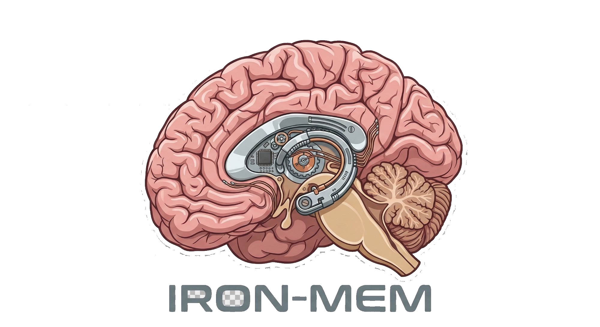

# IronMem


Persistent session memory for Claude Code and any AI coding assistant. Captures what you build each session, compresses it with AI, and injects context into your next session automatically.

Built with Rust. No Bun, no Python, no memecoin.

## How It Works

1. **SessionStart** → reads previous session memories, writes `IRONMEM.md`, adds `@IRONMEM.md` to `CLAUDE.md`
2. **PostToolUse** → records every tool call to SQLite
3. **Stop/SessionEnd** → compresses all observations via Claude API into a 3-5 sentence memory entry
4. Next session: Claude Code reads `@IRONMEM.md` and knows what happened before

## Install

```bash
git clone https://github.com/your-org/ironmem
cd ironmem
chmod +x install.sh
./install.sh
```

Add to your shell profile:
```bash
export PATH="$HOME/.ironmem/bin:$PATH"
export ANTHROPIC_API_KEY="your-key-here"
```

Restart Claude Code.

## Multi-Provider Support

`IRONMEM.md` is a plain markdown file in your project root. It works with any AI coding assistant that reads project context files:

| Tool | How to use |
|------|-----------|
| Claude Code | Auto-imported via `@IRONMEM.md` in `CLAUDE.md` |
| Cursor | Add to `.cursorrules` or project context |
| Windsurf | Add to `.windsurfrules` |
| GitHub Copilot | Add to `.github/copilot-instructions.md` |
| Any other | Just read `IRONMEM.md` directly |

## CLI

```bash
ironmem server              # Start the worker (auto-started by hooks)
ironmem status              # DB stats + worker health
ironmem list                # Recent memories for current project
ironmem search "axum route" # Full-text search
ironmem inject              # Manually rebuild IRONMEM.md
ironmem compress <id>       # Manually compress a session
ironmem wipe                # Delete all memories for current project
ironmem config              # Print current settings
```

## Configuration

`~/.ironmem/settings.json`:

```json
{
  "port": 37778,
  "model": "claude-sonnet-4-20250514",
  "inject_limit": 5,
  "max_observation_bytes": 2048,
  "db_path": "/Users/you/.ironmem/mem.db"
}
```

## Directory Structure

```
~/.ironmem/
├── bin/ironmem          # Binary
├── mem.db               # SQLite database
├── settings.json        # Config
├── current_session      # Active session ID (ephemeral)
└── server.log           # Worker logs

~/.claude/hooks/         # Claude Code hooks
├── session-start.sh
├── post-tool-use.sh
├── stop.sh
└── session-end.sh
```

## License

Apache-2.0 — no strings attached.
