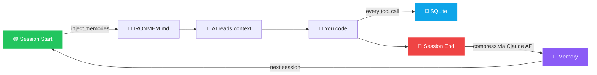

<p align="center">
  
  <br/>
  
</p>

<p align="center">
  <strong>Persistent memory for AI coding assistants.</strong>
</p>

<p align="center">
  Stop re-explaining your project every time you start a new session.
</p>

<p align="center">
  <a href="#install">Install</a> &bull;
  <a href="#how-it-works">How It Works</a> &bull;
  <a href="#cli">CLI</a> &bull;
  <a href="#multi-provider-support">Multi-Provider</a> &bull;
  <a href="#contributing">Contributing</a>
</p>

<p align="center">
  
  
  
  
  
  
  
  <a href="https://github.com/BMC-INC/Iron-mem/actions/workflows/rust.yml"></a>
</p>

<p align="center">
  
  
  
  
  
  
  
</p>

---

<!-- SEO Keywords: AI coding assistant memory, session-aware AI tools, Rust AI tools, context preservation, Claude Code memory, Cursor context -->

## What's New in v0.2.0

> Previously REST-only and local. Now an MCP-native server that works everywhere.

- **10 MCP tools** — session_start, session_end, record_event, compress_session, get_context, get_status, list_memories, search_memories, inject_context, wipe_project
- **Dual database** — SQLite (local, FTS5 full-text search) + Postgres (self-hosted, tsvector) via `DATABASE_URL`
- **Every MCP client** — Claude Desktop, Claude Code, Cursor, Windsurf, ChatGPT Desktop, Zed, and more
- **Docker deployment** — `docker-compose up` for remote/team setups with Postgres
- **`ironmem mcp`** — new subcommand for direct MCP stdio transport (Claude Desktop/Code)
- **REST server still works** — existing hooks and curl-based workflows unaffected
- **Still zero telemetry. Still local-first. Your data stays yours.**

---

IronMem gives AI coding tools persistent memory across sessions.
It silently records what happened during your session, compresses it into concise memory, and injects that context into your next session automatically.

No copy-pasting.
No rebuilding context from scratch.
No "remember when we refactored auth yesterday?"

Runs locally or on your own infrastructure.
No telemetry.
SQLite or Postgres storage.
Plain markdown output.
Single Rust binary.

<p align="center">
  
</p>

## Why this exists

AI coding tools are great inside a session and terrible across sessions.
They help you ship faster, but every fresh session forgets your architecture decisions, debugging trail, and what changed yesterday.

IronMem fixes the handoff.

## Before vs after

Without IronMem:

> "We already changed the auth middleware, switched to JWT, updated the migration, and fixed the failing tests in billing. Let me explain the whole thing again."

With IronMem:

> Open a new session. Your assistant already has the recent project context.

---

## Quick Start

1. **Install IronMem**:
   ```bash
   curl -fsSL https://raw.githubusercontent.com/BMC-INC/Iron-mem/main/install.sh | bash
   ```
2. **Add your API key** (in your `~/.zshrc` or `~/.bashrc`):
   ```bash
   export ANTHROPIC_API_KEY="your-key-here"
   ```
3. **Start coding!** IronMem handles the rest silently in the background.

---

## Table of Contents

- [Quick Start](#quick-start)
- [The Problem](#the-problem)
- [The Fix](#the-fix)
- [Who Should Use This?](#who-should-use-this)
- [How It Works](#how-it-works)
- [Install](#install)
- [CLI](#cli)
- [Multi-Provider Support](#multi-provider-support)
- [Configuration](#configuration)
- [Troubleshooting](#troubleshooting)
- [Architecture](#architecture)
- [Why Rust?](#why-rust)
- [Design Principles](#design-principles)
- [Why not just use CLAUDE.md?](#why-not-just-use-claudemd)
- [Roadmap](#roadmap)
- [Contributing](#contributing)
- [Support](#-support)
- [License](#license)

---

## The Problem

Every time you start a new session with Claude Code, Cursor, Copilot, or any AI coding assistant — it starts from zero. It doesn't know what you built yesterday. It doesn't know what broke. It doesn't know what you decided.

**You end up re-explaining context every single session.**

## The Fix

IronMem silently records what happens during your coding session, compresses it into a concise memory using Claude's API, and injects that context into your next session automatically.

No setup per session. No copy-pasting. No "remember when we..."

<p align="center">
  
</p>

> **Without IronMem:** _"Hey Claude, remember yesterday we refactored the auth middleware and switched to JWT? And the database migration for the users table? And..."_
>
> **With IronMem:** You open a new session. It already knows.

---

## Who Should Use This?

IronMem is designed for:
- **Developers frustrated with re-explaining context** to AI tools every single session.
- **Teams working on large, multi-session projects** where context gets easily lost.
- **Developers frequently switching** between multiple AI tools like Copilot, Claude Code, Windsurf, or Cursor.
- **Solo developers** who want to maintain flow and continuity without manual effort.

---

## How It Works



Everything runs locally. Your data stays on your machine.

---

## Install

```bash
curl -fsSL https://raw.githubusercontent.com/BMC-INC/Iron-mem/main/install.sh | bash
```

Or clone and build manually:

```bash
git clone https://github.com/BMC-INC/Iron-mem.git
cd Iron-mem
chmod +x install.sh
./install.sh
```

Add to your shell profile (`~/.zshrc` or `~/.bashrc`):

```bash
export PATH="$HOME/.ironmem/bin:$PATH"
export ANTHROPIC_API_KEY="your-key-here"
```

Restart your terminal and Claude Code. That's it.

**Requirements:** Rust/Cargo (the installer will tell you if it's missing)

---

## CLI

```bash
ironmem server              # Start REST + MCP SSE server
ironmem mcp                 # Start MCP stdio server (for Claude Desktop/Code)
ironmem status              # Health check + DB stats
ironmem list                # Recent memories for current project
ironmem search "auth middleware"  # Full-text search across memories
ironmem inject              # Manually rebuild IRONMEM.md
ironmem compress <id>       # Manually compress a session
ironmem wipe                # Delete all memories for current project
ironmem config              # Print current settings
```

<p align="center">
  
</p>
<p align="center">
  
</p>

---

## Multi-Provider Support

IronMem works as an **MCP server** (native integration) or via **IRONMEM.md** (plain markdown, universal):

| Platform | MCP Native | IRONMEM.md | Setup |
| -------- | :--------: | :--------: | ----- |
| **Claude Desktop** | **Yes** | Yes | Add to `claude_desktop_config.json` |
| **Claude Code** | **Yes** | Yes | Add to `.mcp.json` or use hooks |
| **Cursor** | **Yes** | Yes | MCP config or `.cursorrules` |
| **Windsurf** | **Yes** | Yes | MCP config or `.windsurfrules` |
| **ChatGPT Desktop** | **Yes** | — | MCP config |
| **Zed** | **Yes** | — | MCP config |
| **VS Code (Copilot/Continue/Cline)** | **Yes** | Yes | MCP config or `.github/copilot-instructions.md` |
| **Any MCP Client** | **Yes** | — | stdio or SSE transport |
| **Any AI Tool** | — | Yes | Read `IRONMEM.md` as project context |

---

## Configuration

`~/.ironmem/settings.json`:

```json
{
  "port": 37778,
  "model": "claude-sonnet-4-6-20250627",
  "inject_limit": 5,
  "max_observation_bytes": 2048,
  "db_path": "/Users/you/.ironmem/mem.db",
  "database_url": null,
  "mcp_transport": "stdio",
  "mcp_sse_port": 37779
}
```

All fields optional. Sensible defaults provided.

| Variable | Default | Description |
|:---------|:--------|:------------|
| `DATABASE_URL` | _(none)_ | Postgres URL. Overrides `db_path` when set. |
| `IRONMEM_MCP_TRANSPORT` | `stdio` | MCP transport: `stdio` or `sse` |
| `ANTHROPIC_API_KEY` | _(none)_ | Required for session compression |

### API Key

IronMem needs an Anthropic API key to compress session observations into memories. It checks two locations:

1. **`ANTHROPIC_API_KEY` environment variable** — set this in your shell profile
2. **`~/.ironmem/api_key` file** — auto-created by the session-start hook as a fallback

The file fallback exists because the IronMem server runs as a background process via `nohup`, and some environments strip environment variables from child processes. The session-start hook automatically persists your API key to `~/.ironmem/api_key` (with `chmod 600` permissions) so the server can always access it.

---

## Troubleshooting

**Server not starting:**

```bash
ironmem status                           # Check if server responds
cat ~/.ironmem/server.log                # Check server logs
~/.ironmem/bin/ironmem server            # Run manually to see errors
```

**Observations not being recorded:**

```bash
ironmem status                           # Check observation count
sqlite3 ~/.ironmem/mem.db "SELECT count(*) FROM observations;"
```

If count stays at 0, your hooks may not be installed. Re-run `./install.sh` or check that `~/.claude/hooks/post-tool-use.sh` exists and is executable.

**Compression failing (memories always 0):**

```bash
# Check if the API key is accessible
cat ~/.ironmem/api_key                   # Should contain your key
echo $ANTHROPIC_API_KEY                  # Should be set

# Try manual compression
ironmem compress <session-id>            # Get session ID from server.log
```

**Hooks not firing:**
Check that `~/.claude/settings.json` has the hooks registered under the `"hooks"` key. Re-running `./install.sh` will fix this.

---

## Architecture

```text
~/.ironmem/
├── bin/ironmem          # Single compiled binary
├── mem.db               # SQLite database (FTS5 full-text search)
├── settings.json        # Configuration
├── api_key              # Anthropic API key (auto-persisted, chmod 600)
├── current_session      # Active session ID (ephemeral)
└── server.log           # Worker logs

~/.claude/hooks/         # Auto-installed Claude Code hooks
├── session-start.sh     # Injects memories on session start
├── post-tool-use.sh     # Records every tool call
├── stop.sh              # Triggers compression
└── session-end.sh       # Cleanup
```

**~1,700 lines of Rust.** MCP-native. SQLite or Postgres. One binary. No external runtimes.

---

## Why Rust?

Rust was chosen for IronMem to deliver:
- **Maximum Performance:** Minimal overhead and lightning-fast execution, essential for a tool that hooks into every single CLI command.
- **Zero Dependencies:** Compiles down to a single binary. No need to install Python, Node.js, or complex runtime environments.
- **Memory Safety & Reliability:** Guaranteed safety without a garbage collector ensures the background worker remains rock-solid and leak-free.

---

## Design Principles

- **Zero friction** — hooks run silently, never interrupt your workflow
- **Local-first** — runs on your machine by default, your data stays yours
- **MCP-native** — speaks the protocol every major AI client is adopting
- **Provider-agnostic** — MCP for native integration, plain markdown for everything else
- **Self-hostable** — Docker + Postgres for team deployments, still zero cloud dependencies
- **Fail-safe** — if IronMem crashes, your coding session is unaffected

---

## Who this is for

IronMem is for developers who use AI coding tools heavily and want continuity across sessions.

It is especially useful if you:
- switch between Claude Code, Cursor, Copilot, or Windsurf
- work on projects that span many sessions
- are tired of re-explaining architecture, bugs, and recent changes
- want local-first memory instead of a hosted service

## Who this is not for

IronMem is not trying to be:
- a generic memory platform for every kind of agent
- a cloud sync product
- a team knowledge base
- a dashboard-heavy workflow tool

It solves one narrow problem well: session memory for AI coding workflows.

---

## Why not just use CLAUDE.md?

`CLAUDE.md` is great for static project context — things like "use tabs not spaces" or "we use Axum for routing." But it's manual. You write it, you maintain it, and it doesn't know what happened last session.

IronMem is **automatic and session-aware:**

|   | CLAUDE.md | IronMem |
| - | --------- | ------- |
| **Updates** | You write it manually | Auto-generated from session activity |
| **Scope** | Static project rules | Dynamic session history |
| **Rotation** | You manage it | Old memories age out automatically |
| **Search** | Ctrl+F | Full-text search across all sessions |
| **Effort** | High | Zero — hooks handle everything |

They work together. `CLAUDE.md` holds your project rules. IronMem holds what happened.

---

## Docker Deployment

Run IronMem with Postgres for team/remote setups:

```bash
ANTHROPIC_API_KEY=your-key docker-compose up --build
```

This starts IronMem in SSE mode on `http://localhost:37779/sse` with Postgres 16, plus the REST server on `http://localhost:37778`.

---

## Roadmap

- [ ] Windows native support
- [ ] Neovim plugin
- [ ] VSCode extension
- [ ] OpenAI / Gemini provider support (for compression)
- [ ] Web UI for memory browser

---

## Contributing

Contributions are welcome. Please read [CONTRIBUTING.md](CONTRIBUTING.md) before opening a PR.

**TL;DR:** Open an issue first. Bug fixes and provider compatibility improvements are always welcome. We don't accept changes that add runtime dependencies or complexity.

---

## ⭐ Support

If you find IronMem useful, please consider giving it a star! 🌟
This helps others discover the project and motivates further development.
Contributions, issues, and feature requests are also highly welcome.

---

## License

Apache-2.0 © 2026 ExecLayer Inc

**Maintainer:** [James Benton](https://github.com/BMC-INC)
