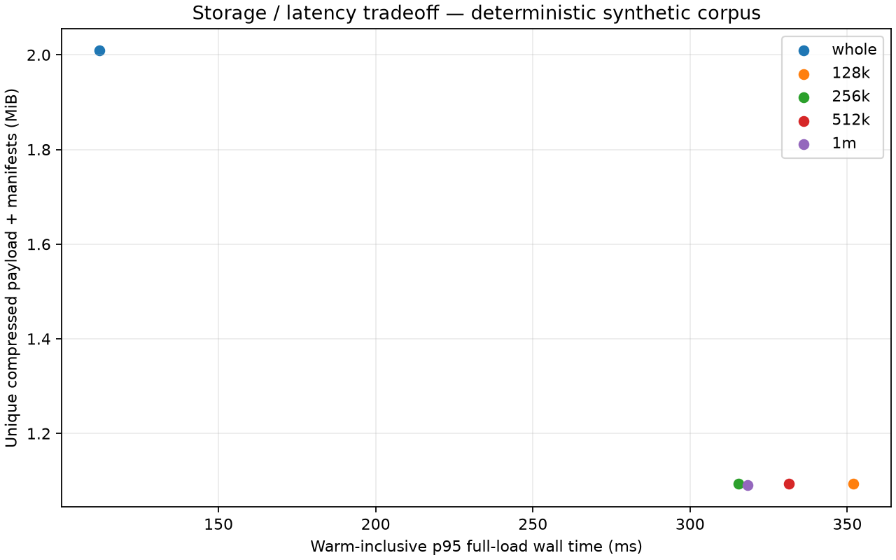

# Foundations validation — September 7, 2026

Implementation measured: `01dac52e353466bcf1fa6d176bbb64bd60ec7664`.
Compiled source fingerprint: `ed57185b7a798668d1e3b24a453236ac58665e24ab132e52def85f2c8b6e168d`.
Subsequent evidence-only commits do not change the implementation.

## Verification

- Full local Rust suite: **295 passed, 0 failed, 2 ignored**. The ignored tests are the optional CCR performance benchmark and opt-in PostgreSQL integration test.
- PostgreSQL 16 integration: **1 passed**, run separately against an isolated temporary database.
- Deterministic evaluation: **72/72 passed**.
- `cargo build`, `cargo fmt --check`, and `cargo clippy -- -D warnings`: passed.
- The final extension covering legacy checkpoint expansion passed its focused regression after the comprehensive suite.
- Both LongMemEval and LoCoMo fixtures completed a full-context baseline and all seven renderer budgets. These are **unscored harness checks**, not model-quality evidence.
- Five storage modes recovered every original exactly. Checkpoint CLI measurement verified full/delta restore, no-change reuse and independently flattened export.

Reproduction commands and boundaries are in [README.md](README.md). CI additionally checks Linux, macOS and Windows, a separate PostgreSQL job, deterministic evaluation and both benchmark adapters. Consult the PR checks for remote results; the list above records local evidence.

## Storage and latency

All runs use the same deterministic corpus and compiled source. Measurements use an Intel i9 Mac, debug builds and uncontrolled OS caches, without concurrent task builds/tests. Timings mix initial and warm loads; these observations are not production performance guarantees.

| Write mode / threshold | Unique payload bytes | Database bytes | p95 load ms |
|---|---:|---:|---:|
| whole | 2,106,800 | 2,600,960 | 112.2 |
| 128k | 1,147,397 | 1,687,552 | 352.0 |
| 256k | 1,147,397 | 1,687,552 | 315.3 |
| 512k | 1,147,397 | 1,687,552 | 331.4 |
| 1m | 1,143,353 | 1,675,264 | 318.3 |

Chunking saved **45.5–45.7%** of compressed payload and **35.1–35.6%** of database space. p95 load latency increased approximately **2.8–3.1×**. **Whole-object writes remain the default.** Source bytes, database overhead, manifest/chunk totals and exposure at each budget are recorded separately in [raw results](results/whole/report.json) and the four sibling threshold directories.

## Checkpoints

The deterministic 50-memory fixture stored a full payload in **2,209 bytes** and a one-memory-update delta in **551 bytes**. An unchanged capture reused the same payload hash. Full restore took **423 ms**, delta restore **604 ms**, including CLI startup and migration. This small fixture has no source blobs; source-inclusive binary recovery is covered separately by integration tests. See [raw checkpoint measurements](results/checkpoints.json).

Deltas reduce stored changes; capture still scans the complete state. They use verified transactional row-set differences because the existing mutation ledger does not cover all authoritative writes. Chains are bounded, dependencies are pinned, and portable exports flatten the chain.

## Remaining evaluation and cleanup

Accuracy, tokenizer counts, physical disk reads, CPU time and peak memory remain unmeasured/null. No noninferiority or model-quality improvement is claimed. Paid model evaluations, production conversion, installed service restarts and steps 4–6 are outside this checkpoint.

Keep `results/` and `figures/` as the single final evidence set. Intermediate benchmark runs, temporary PostgreSQL data, plotting environment and this checkout's reproducible build artifacts can be removed after verification; unrelated checkouts and user files are preserved.
